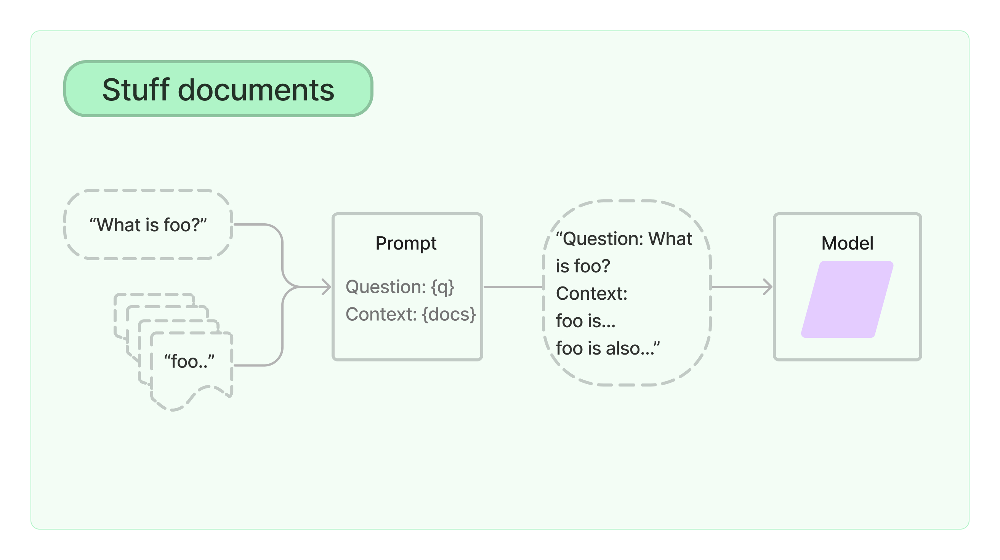
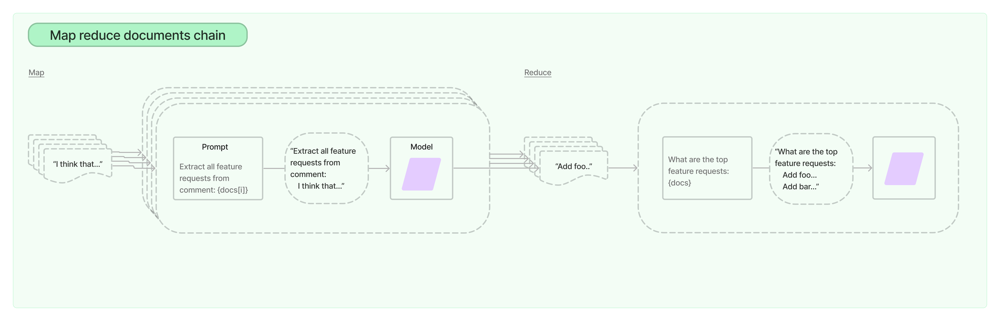
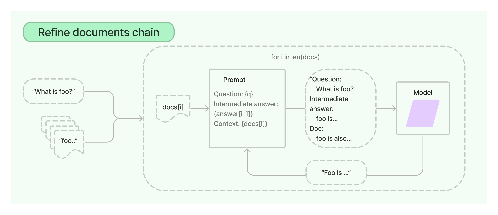
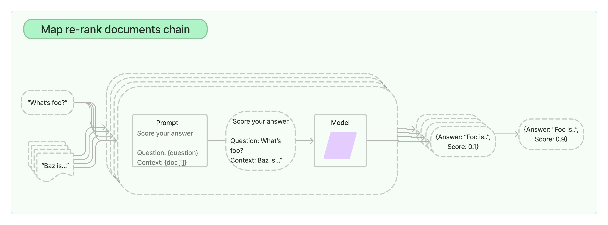

## Retriever
Retriever는 사용자의 질문을 임베딩한 벡터와 유사한 벡터를 벡터 저장소에서 찾은 후, 사용자의 질문과 함께 묶어 Prompt를 LLM에 전달하는 역할을 하며, Retriever는 문서를 저장하지 않고 단지 검색하여 반환만 할 수 있다.

## Chain
분할된 텍스트를 context에 주입할 때 LLM에 참고할 자료를 넘겨주는 방법에 따라 4가지의 chain이 존재한다.

### Stuff documents chain

사용자의 질문과 유사한 텍스트 chunk들을 모두 Prompt의 context에 주입하여 LLM이 참고할 수 있도록 하며, 따라서 토큰 이슈가 발생할 수 있다.

### Map reduce documents chain

Map 과정을 통해 사용자의 질문과 유사한 텍스트 chunk들 각각에 대해 요약을 생성하고, Reduce 과정을 통해 이를 합쳐 최종 요약을 생성하여 LLM이 참고할 수 있도록 한다. 토큰 이슈를 피할 수 있다는 장점이 있지만, 텍스트 chunk 각각에 대해 요약을 수행하는 과정에서 LLM 호출이 이루어지기 때문에 속도가 느리다.

### Refine documents chain

Refine documents chain은 좋은 품질의 답변을 얻기 위해 사용되는 chain으로, 사용자의 질문과 유사한 텍스트 chunk들을 순회하며 누적 답변을 생성한다. 특정 텍스트 chunk를 참고하여 LLM으로부터 얻은 intermediate answer와 다음 텍스트 chunk를 LLM에 다시 전달하여 답변을 얻음으로서 답변을 누적해나가고, 따라서 속도가 느리다.

### Map re-rank documents chain

사용자의 질문과 유사한 텍스트 chunk 각각에 대해 LLM 호출을 통해 답변을 생성하며, 사용자의 질문과 context간의 연관성을 나타내는 점수가 함께 나오게 되어 가장 연관성 점수가 높은 답변을 출력한다. LLM을 여러 번 호출하기 때문에 비용이나 시간 문제가 발생한다.

## 실습
```python
import os
import openai
from langchain.chains import RetrievalQA
from langchain_openai import ChatOpenAI
from langchain.text_splitter import RecursiveCharacterTextSplitter
from langchain_community.vectorstores import Chroma
from langchain_community.document_loaders import PyPDFLoader
from langchain_community.embeddings import HuggingFaceEmbeddings
import tiktoken
from langchain.callbacks.streaming_stdout import StreamingStdOutCallbackHandler

### api.txt에서 API key 읽어오기 ###
f = open("api.txt", "r")
api_key = f.readline()
f.close()

### api.txt에서 읽어온 키를 넣어주기! ###
os.environ["OPENAI_API_KEY"] = api_key
os.environ["TOKENIZERS_PARALLELISM"] = "false"

### load tokenizer ###
tokenizer = tiktoken.get_encoding("cl100k_base")

def tiktoken_len(text):
    tokens = tokenizer.encode(text)
    return len(tokens)

### Load & Split PDF ###
loader = PyPDFLoader("2023_curriculum.pdf")
pages = loader.load_and_split()

### Chunking ###
text_splitter = RecursiveCharacterTextSplitter(chunk_size=500, chunk_overlap=100, length_function=tiktoken_len)
texts = text_splitter.split_documents(pages)

### embedding model ###
model_name = "jhgan/ko-sbert-nli"
model_kwargs = {'device': 'cpu'}
encode_kwargs = {'normalize_embeddings': True}

hf = HuggingFaceEmbeddings(
    model_name=model_name,
    model_kwargs=model_kwargs,
    encode_kwargs=encode_kwargs
)

### Load to Chroma ###
docsearch = Chroma.from_documents(texts, hf)

### Load ChatGPT model###
chatgpt = ChatOpenAI(
    model_name="gpt-3.5-turbo", 
    streaming=True, 
    callbacks=[StreamingStdOutCallbackHandler()], 
    temperature=1
)

qa = RetrievalQA.from_chain_type(llm=chatgpt,
                                 chain_type="stuff",
                                 retriever=docsearch.as_retriever(
                                     search_type="mmr",
                                     search_kwargs={'k': 3, 'fetch_k': 7}),
                                 return_source_documents=True
)

query = "논리적인 사고를 기를 수 있는 수업에는 뭐가 있어? 그 이유도 알려줘."

result = qa.invoke(query)
```
`stuff` chain을 사용하였으며, `as_retriever()`을 통해 Chroma 객체를 검색기로 활용하였고, 이때 `search_type`을 `mmr`로 설정하면 사용자의 질문과 유사한 텍스트 chunk 후보들 중 다양성을 고려하여 텍스트 chunk들을 LLM으로 전달하게 된다. 또한, `search_kwargs`에서 `fetch_k`를 7, `k`를 3으로 하여 7개의 후보 중에서 3개의 텍스트 chunk를 최종적으로 context로 LLM에 넘겨주게 된다.</br>
`return_source_documents`를 `True`로 설정하여 LLM이 답변을 할 때 참고한 context가 어떤 문서의 어느 위치에 존재하는 지 알 수 있게끔 한다.

실행 결과
```
논리적인 사고를 기를 수 있는 수업으로는 "CMST301 – 논리와 비판적 사고 (Logic and Critical Thinking)"가 있습니다. 이 수업은 우리의 세계를 서술하고, 설명하고, 예측하고, 이해하는 사고의 힘인 논리를 학습하는 과목입니다. 고전논리와 기호논리, 연역논리와 비연역논리를 도구로 활용하여 실재세계와 가상세계, 역사세계와 가능세계를 비판하고, 탐색하고, 변형하고, 창조하는 사고능력을 키우는데 목표를 둡니다. 이를 통해 학생들은 뒷받침되지 않은 주장을 식별하고, 논리적으로 생각하며, 비판적 사고를 발전시킬 수 있습니다.
```

## 참고 문헌
- https://www.youtube.com/watch?v=tQUtBR3K1TI&list=PLQIgLu3Wf-q_Ne8vv-ZXuJ4mztHJaQb_v&index=9
- https://js.langchain.com/docs/modules/chains/document/stuff
- https://js.langchain.com/docs/modules/chains/document/map_reduce
- https://js.langchain.com/docs/modules/chains/document/refine